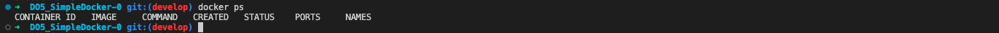
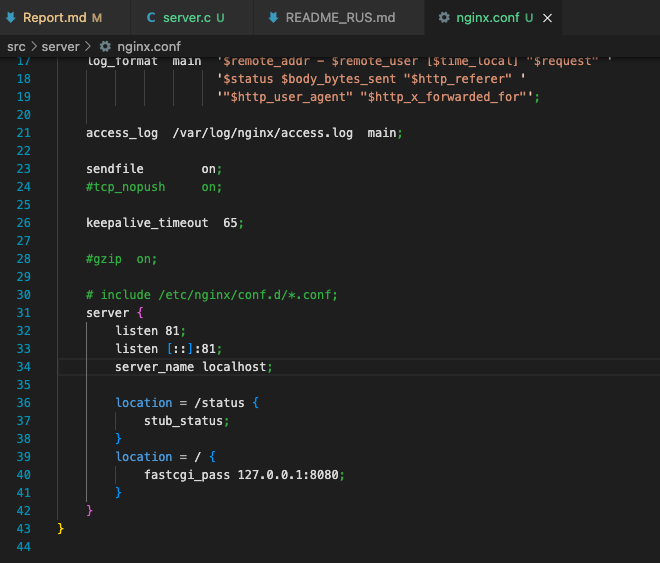

# Simple Docker

## Contents

[Готовый докер](#part-1-готовый-докер) \
[Операции с контейнером](#part-2-операции-с-контейнером) \
[Мини веб-сервер](#part-3-мини-веб-сервер) \
[Свой докер](#part-4-свой-докер) \
[Dockle](#part-5-dockle) \
[Базовый Docker Compose](#part-6-базовый-docker-compose)

## Part 1. Готовый докер

## Взять официальный докер образ с nginx и выкачать его при помощи docker pull
## Проверить наличие докер образа через docker images

1. Ниже скриншот показывает, что докер образ скачен и имеется.

## Запустить докер образ через docker run -d [image_id|repository]

## Проверить, что образ запустился через docker ps

1. На скриншоте видно, что докер запустился.

## Посмотреть информацию о контейнере через docker inspect [container_id|container_name]

## По выводу команды определить и поместить в отчёт размер контейнера, список замапленных портов и ip контейнера

1. На скриншоте виден размер контейнера.

2. На скриншоте показан айпи-адрес контейнера. 

## Остановить докер образ через docker stop [container_id|container_name]

## Проверить, что образ остановился через docker ps

На скриншоте видно по выводу команды, что образ остановился.

## Запустить докер с замапленными портами 80 и 443 на локальную машину через команду run

## Проверить, что в браузере по адресу localhost:80 доступна стартовая страница nginx

1. На скриншоте показан старт докера с портами 80 и 443.
2. На скриншоте показана стартовая страница nginx(работает).

## Перезапустить докер контейнер через docker restart [container_id|container_name]

## Проверить любым способом, что контейнер запустился.

На скриншоте показан рестарт докера и через команду docker ps, что докер запустился.

# Part 2. Операции с контейнером

## Прочитать конфигурационный файл *nginx.conf* внутри докер контейнера через команду *exec*

На скришоте показан конфигурационный файл nginx.conf

## Создать на локальной машине файл *nginx.conf*

На скриншоте показана команда touch по созданию файла и то, что файл успешно создался

## Настроить в нем по пути */status* отдачу страницы статуса сервера **nginx**

На скриншоте показан измененный файл с нужными данными

## Скопировать созданный файл *nginx.conf* внутрь докер образа через команду `docker cp`
## Перезапустить **nginx** внутри докер образа через команду *exec*

На скриншоте показана команда docker cp, docker exec

## Проверить, что по адресу *localhost:80/status* отдается страничка со статусом сервера **nginx**

На скриншоте показан статус сервира nginx

# Экспортировать контейнер в файл *container.tar* через команду *export*

На скриншоте показана команда docker export

## Остановить контейнер

На скриншоте показан результат команды docker stop

## Удалить образ через `docker rmi [image_id|repository]`, не удаляя перед этим контейнеры

На скриншоте показан вывод команды docker rmi

## Удалить остановленный контейнер

На скриншоте показан вывод команды docker rm

## Импортировать контейнер обратно через команду *import*

На скриншоте показан вывод команды docker import

## Запустить импортированный контейнер

На скриншоте показан вывод команды docker run

## Проверить, что по адресу *localhost:80/status* отдается страничка со статусом сервера **nginx**

На скриншоте видна страница сервера со статусом

## Part 3. Мини веб-сервер

## Написать мини сервер на **C** и **FastCgi**, который будет возвращать простейшую страничку с надписью `Hello World!`
## Запустить написанный мини сервер через *spawn-fcgi* на порту 8080
## Написать свой *nginx.conf*, который будет проксировать все запросы с 81 порта на *127.0.0.1:8080*
## Проверить, что в браузере по *localhost:81* отдается написанная вами страничка
## Положить файл *nginx.conf* по пути *./nginx/nginx.conf* (это понадобится позже)

1. Создаем папку server, переходим в нее, создаем файл server.c и пишем свой мини-сервер. 

2. Далее создаем новый nginx.conf

3. Далее я скачала докер nginx и проверила, что он успешно скачался и запустился

4. Копирую nginx.conf, server.c в докер

5. Вхожу в сам контейнер и проверяю, что все файлы правильно скопировались

6. Скачиваем нужные команды: gcc, spawn-fcgi, libfcgi-dev
7. Компиляция файла server.c и запуск его через spawn-fcgi

8. Перезагрузка контейнера и проверка страницы в браузере

9. Перекидываем по заданию nginx.conf в папку nginx

## Part 4. Свой докер

## Написать свой докер образ, который:
## 1) собирает исходники мини сервера на FastCgi из [Части 3](#part-3-мини-веб-сервер)
## 2) запускает его на 8080 порту
## 3) копирует внутрь образа написанный *./nginx/nginx.conf*
## 4) запускает **nginx**.

1. Пишем свой докер образ

Создаем файл Dockerfile и в нем создаем докер-образ:

2. Пишем скрипт, который будет собирать образ и запускать его на 8080 порту

Создаем скрипт(у меня start_server.sh), внутри прописываем сборку образа и его запуск на 8080 порту:

## Собрать написанный докер образ через docker build при этом указав имя и тег
## Проверить через docker images, что все собралось корректно

1. С помощью команды docker build собираем наш докер образ, а так же через команду docker images проверяем, что образ собрался корректно:

## Запустить собранный докер образ с маппингом 81 порта на 80 на локальной машине и маппингом папки ./nginx внутрь контейнера по адресу, где лежат конфигурационные файлы nginx'а (см. Часть 2)

С помощью команды docker run запускаем наш собранный докер и делаем маппинг папки nginx:

## Проверить, что по localhost:80 доступна страничка написанного мини сервера

1. С помощью команды curl localhost:80 проверяем, что страничка доступна:

## Дописать в ./nginx/nginx.conf проксирование странички /status, по которой надо отдавать статус сервера nginx

## Перезапустить докер образ

## Проверить, что теперь по localhost:80/status отдается страничка со статусом nginx

## Part 5. Dockle

## Просканировать образ из предыдущего задания через `dockle [image_id|repository]`
## Исправить образ так, чтобы при проверке через **dockle** не было ошибок и предупреждений

1. Скачиваем dockle: 

2. Запускаем dockle:

3. Исправляем ошибки - start_server.sh я добавила разрешение на запуск скрипта; в Dockerfile добавила нового пользователя, так как dockle ругался на то, что запуск должен быть не от пользователя root+добавила чистку кэша:

После всех исправлений удаляем докер образ и снова его билдим:

4. Снова проверяем образ командой dockle:

## Part 6. Базовый Docker Compose

## Написать файл *docker-compose.yml*, с помощью которого:
## 1) Поднять докер контейнер из [Части 5](#part-5-инструмент-dockle) _(он должен работать в локальной сети, т.е. не нужно использовать инструкцию **EXPOSE** и мапить порты на локальную машину)_
## 2) Поднять докер контейнер с **nginx**, который будет проксировать все запросы с 8080 порта на 81 порт первого контейнера
## Замапить 8080 порт второго контейнера на 80 порт локальной машины

1. Создаем и пишем docker-compose.yml:

## Остановить все запущенные контейнеры
## Собрать и запустить проект с помощью команд `docker-compose build` и `docker-compose up`
## Проверить, что в браузере по *localhost:80* отдается написанная вами страничка, как и ранее

1. Используем команды docker-compose build и docker-compose up, и далее проверяем, что страничка выдается:

